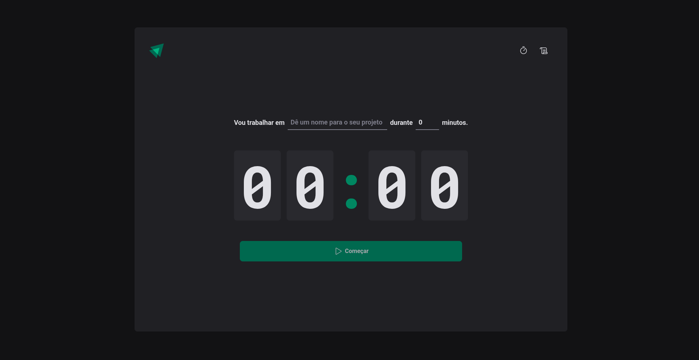
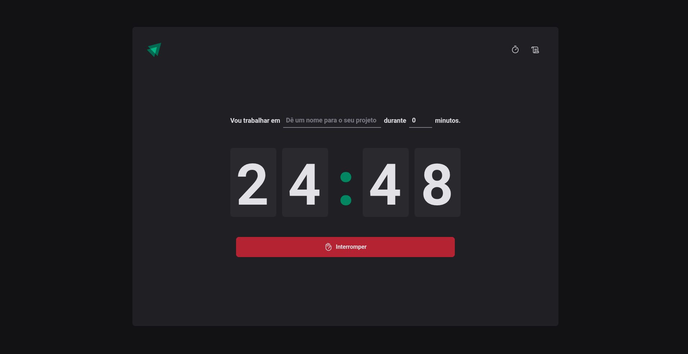
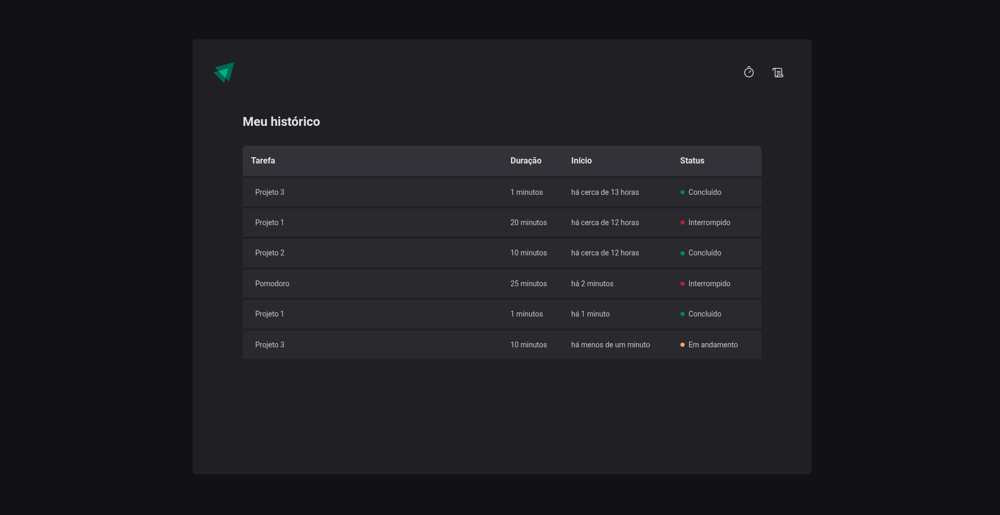

# Timer

## Este é um projeto de Timer desenvolvido como desafio prático para reforçar conceitos fundamentais do ReactJS. 

    
    
    

# Funcionalidades

- Adicionar uma nome para o timer

- Escolher o período de tempo que o timer irá durar

- É possível interromper um timer em andamento

- O histórico de tarefas é mostrado, categorizados em: 'concluído', 'interrompido' ou 'em andamento', além de ter o nome da tarefa 

- Estados são salvos no storage

# Conceitos abordados

- React Hooks (useEffect, useState, useReducer) - Para gerenciamento de estado

- Imutabilidade do estado

- React Router DOM

- TypeScript - Para lógica de programação e tipagem 

- Contextos

- Reducers

- Styled Components - Para estilização da interface

# Como utilizar

1- Clone o projeto
`git@github.com:helen-andrade/timer.git`

2- Instale as dependências
`npm i`

3- Rode o script de desenvolvimento
`npm run dev`

---

    
Feito com ♡ por Helen Andrade

